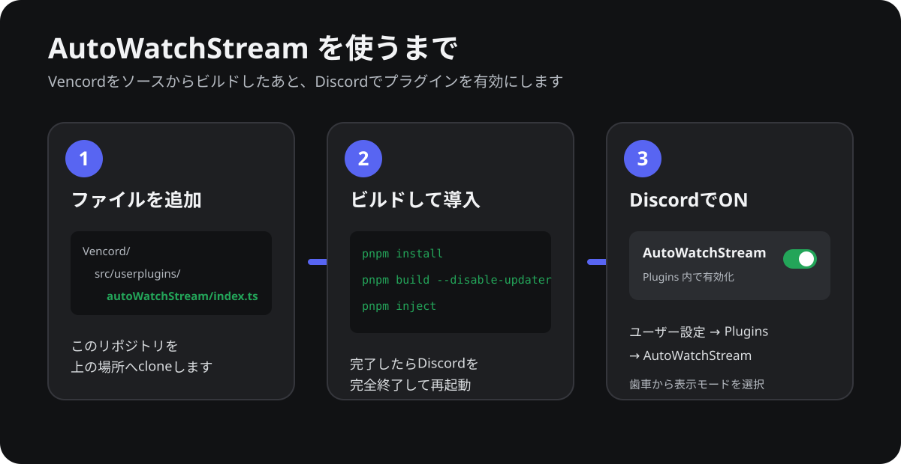
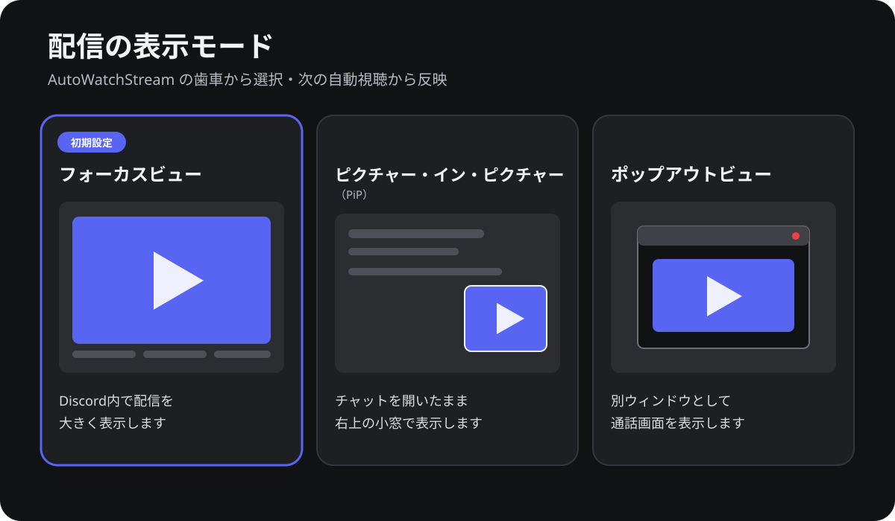

# AutoWatchStream

同じボイスチャンネルにいる人が配信を始めたら、自動で「配信を見る」を実行するVencord用プラグインです。



## できること

- 同じVCで新しく始まった配信を自動で開きます。
- すでに別の配信を見ている場合は、勝手に切り替えません。
- 手動で閉じた配信を何度も開き直しません。
- 表示方法を3種類から選べます。



| 表示モード | 動作 |
| --- | --- |
| **フォーカスビュー**（初期設定） | Discord内で配信を大きく表示 |
| **ピクチャー・イン・ピクチャー（PiP）** | チャットを開いたまま右上の小窓で表示 |
| **ポップアウトビュー** | 通話画面を別ウィンドウで表示 |

## Windowsへ簡単インストール

対象はWindows 10／11のデスクトップ版Discordです。スマホ版では動きません。

### 1. CMDを開く

スタートメニューで **cmd** と検索し、**コマンド プロンプト**を開きます。管理者として開く必要はありません。

### 2. 次の1行を貼り付ける

下の1行をすべてコピーし、CMDへ貼り付けてEnterを押します。

```bat
curl.exe -L "https://raw.githubusercontent.com/nobu-nobu/vencord-auto-watch-stream/main/install-windows.cmd" -o "%TEMP%\install-autowatchstream.cmd" && call "%TEMP%\install-autowatchstream.cmd"
```

このスクリプトが以下を順番に行います。

1. Gitがなければ、Windowsの`winget`でインストール
2. Node.js LTSがなければ、`winget`でインストール
3. Vencordを`%USERPROFILE%\AutoWatchStream\Vencord`へ取得
4. AutoWatchStreamを`src\userplugins`へ追加
5. Vencordが指定するバージョンのpnpmをインストール
6. 必要なファイルをダウンロードしてビルド
7. カスタムVencordをデスクトップ版Discordへ導入

途中でWindowsの確認画面が表示された場合は、内容を確認して許可してください。赤いエラーが出ず、最後に`Installation completed successfully`と表示されれば完了です。

> [!NOTE]
> GitまたはNode.jsを初めて導入した直後、CMDの再起動を求められる場合があります。その場合はCMDを閉じ、もう一度開いて同じ1行を実行してください。途中まで導入済みの項目は自動で再利用されます。

### 3. DiscordでONにする

1. Discordを完全終了し、起動し直します。
2. 左下の **ユーザー設定（歯車）** を開きます。
3. **Vencord Settings → Plugins** を開きます。
4. **AutoWatchStream** を検索してONにします。
5. AutoWatchStreamの歯車から表示モードを選びます。

相手と同じVCへ参加したあと、相手に配信を開始してもらってください。すでに配信中だった場合は、一度配信を止めて再開してもらいます。

## すでにGit・Node.js・pnpm・Vencordがある場合

VencordフォルダをCMDで開き、次の4行を順番に実行します。

```bat
git clone https://github.com/nobu-nobu/vencord-auto-watch-stream.git src\userplugins\autoWatchStream
pnpm install --frozen-lockfile
pnpm build --disable-updater
pnpm inject
```

終わったらDiscordを完全終了して起動し直し、Plugins画面でAutoWatchStreamをONにします。

## 更新方法

最初のインストールと同じ1行を、CMDでもう一度実行してください。VencordとAutoWatchStreamを更新し、再ビルドします。

```bat
curl.exe -L "https://raw.githubusercontent.com/nobu-nobu/vencord-auto-watch-stream/main/install-windows.cmd" -o "%TEMP%\install-autowatchstream.cmd" && call "%TEMP%\install-autowatchstream.cmd"
```

更新後はDiscordを完全終了して起動し直してください。

## よくある問題

### AutoWatchStreamがPluginsに出ない

- Discordを右上の×だけで閉じず、タスクトレイから完全終了して起動し直してください。
- CMDに`Build failed`や`Installation stopped`が出ていないか確認してください。

### 配信が自動で開かない

- **ユーザー設定 → Plugins → AutoWatchStream**がONか確認してください。
- 相手と同じVCへ先に参加してください。
- すでに始まっている配信は対象外です。一度止めて再開してもらってください。
- ほかの配信を視聴中の場合は、自動で切り替えません。

### 元のDiscordへ戻したい

`%USERPROFILE%\AutoWatchStream\Vencord`をCMDで開き、次を実行します。

```bat
cd /d "%USERPROFILE%\AutoWatchStream\Vencord"
pnpm uninject
```

その後、Discordを完全終了して起動し直します。

## 注意事項

- Vencordとこのプラグインは非公式であり、DiscordおよびVencord公式とは関係ありません。
- VencordはDiscordのクライアントModです。利用は各自の判断で行ってください。
- Discordの内部処理を利用しているため、Discordの更新で動かなくなる場合があります。
- `%USERPROFILE%\AutoWatchStream`は導入後も使用されるため、利用中は移動・削除しないでください。
- 自動更新でUserPluginが消えないよう、ビルドでは`--disable-updater`を使用しています。

Vencord公式資料：[ソースからの導入](https://docs.vencord.dev/installing/)／[Custom Plugins](https://docs.vencord.dev/installing/custom-plugins/)

## 開発者向け検証

2026-09-23時点で、自動視聴による映像表示を確認済みです。型チェック・lint・ビルド・14項目の模擬テストを通しています。表示モード3種類すべての実機確認は未完了です。

```bat
node src\userplugins\autoWatchStream\tests\behavior.cjs
pnpm testTsc
pnpm exec eslint src\userplugins\autoWatchStream\index.ts
```

模擬テストは実際のDiscord接続や映像再生を検証するものではありません。

## ライセンス

GPL-3.0-or-later。Vencord由来の著作権表示を保持しています。
